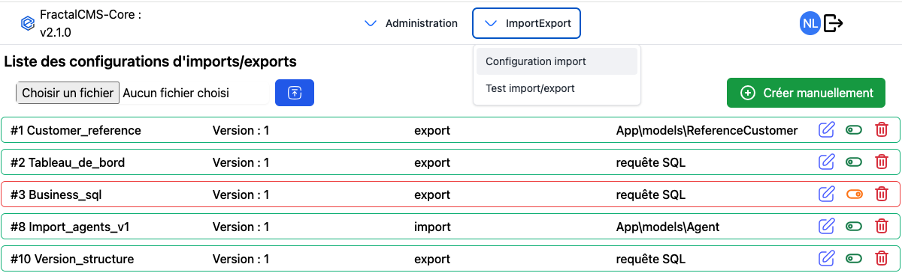
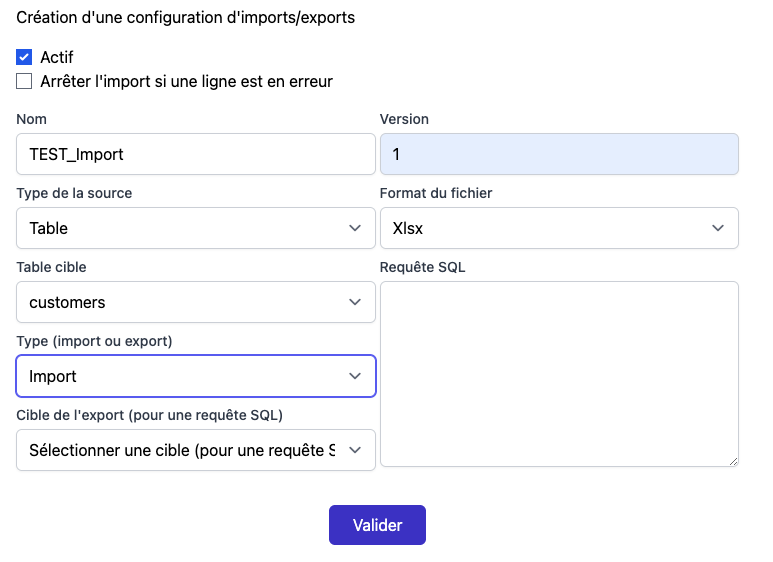
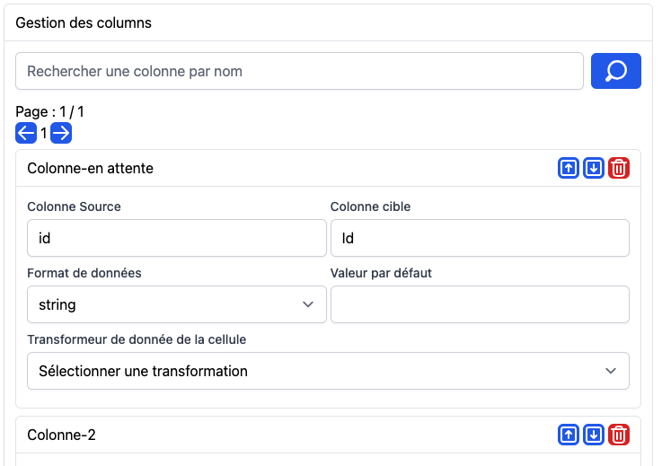
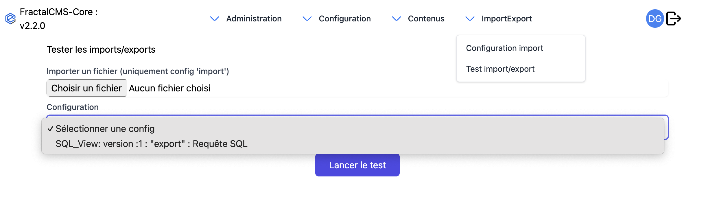

# Configuration

## Gestion de la configuration des imports ou exports

### Interface



### Créer

Afin de créer une nouvelle configuration 2 chemins sont prévus.

#### Import d'un fichier JSON

En important un fichier au format JSON avec le format suivant :

```json
{
  "name": "nom de la configuration",
  "version": 1,
  "table": "nom de la table",
  "type": "type ('import' ou 'export')",
  "sourceType":"la source ('table', 'sql', 'extern')",
  "active": 1,
  "stopOnError":"1 ou 0, permet de stopper dès la première erreur",
  "rowTransformer":"nom de votre row transformer",
  "columns": [
    {
      "source": "column-1",
      "target": "Colonne 1",
      "format": "string"
    },
    {
      "source": "column-2",
      "target": "Colonne 2",
      "format": "string"
    },
     {
      "source": "dateStart",
      "target": "Date_entree",
      "format": "string",
      "transformer":{
          "name":"date"
      },
      "transformerOptions":{
        "from":"d/m/Y",
        "to":"Y-m-d"
      }
    },
     {
      "source": "dateEnd",
      "target": "Date_sortie",
      "format": "string",
       "transformer":{
          "name":"agent"
      },
      "transformerOptions":{
        "from":"d/m/Y",
        "to":"Y-m-d"
      }
    }
  ]
}
```
Le fichier sera vérifié, validé, le formulaire et les colonnes seront automatiquement créées et l'application redirigera vers le formulaire valorisé.

### Création manuelle 

En cliquant sur le bouton "Créer manuellement", un formulaire de création sera proposer.


**Attention**: la clé [nom, version] doit-être unique dans l'application

* **Actif** : La configuration est active
* **Nom** : Obligatoire : nom de la configuration
* **version** : Obligatoire : version de cette configuration
* **Type de la source** : Obligatoire : Type de la source ou cible des données
    * **externe** : Résultat d'une requête vers un array ..
    * **table** : Table de la base de données
    * **SQL** : Requête SQL
* **Format du fichier** : Format du fichier d'import ou du fichier exporté
* **Table cible** : table de la base de données ciblé (type de source = 'table')
* **Requête SQL** : Requête SQL ciblé (type de source = 'sql')
* **type** : Configuration pour un **import** ou un **export**
* **Cible de l'export** : Dans le cas d'un requête SQL, ce paramètre permet de déterminer si l'export relancera la requête SQL ou lira la view généré
* **transformer des colonnes** : Vos transformers que vous avez ajouté dans la configuration du composant (voir [initialisation](initialisation.md))



#### Une fois le formulaire rempli et validé 

Selon le type de la source les colonnes seront automatiquement générées ('table', 'sql')  ou doivent-être créées manuellement.
Dans tous les cas les colonnes peuvent être modifiées.



Chaque colonne peuvent-être paramétrées individuellement, les transformeurs peuvent-être utilisés afin
de convertir la donnée vers le format voulu pour l'import ou l'export

## L'interface de test



Cette interface permet de tester les configurations d'import et d'export.

Les imports testé sont encadrés par une transaction SQL afin qu'aucune données ne soient enregistré.

L'interface affichera les erreurs.

Les exports seront réalisé avec une limite de mémoire calculée. les gros exports Xslx ne seront pas exécutés.

[<- Précédent](concept.md) | [Suivant ->](transformer.md)