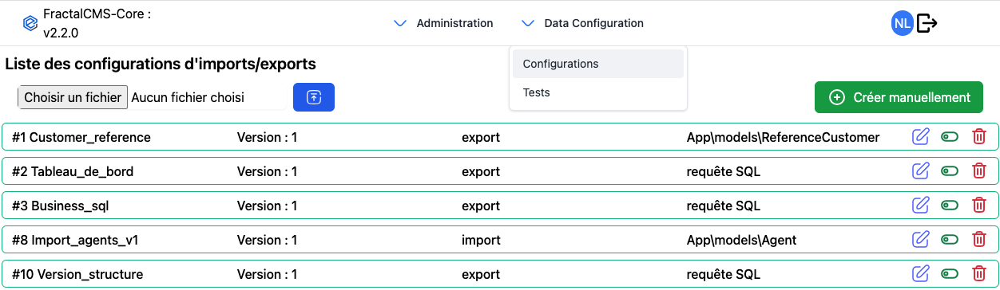
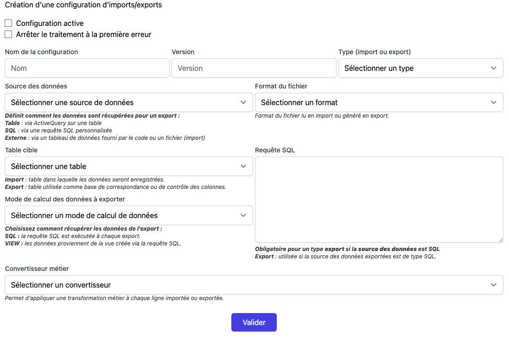
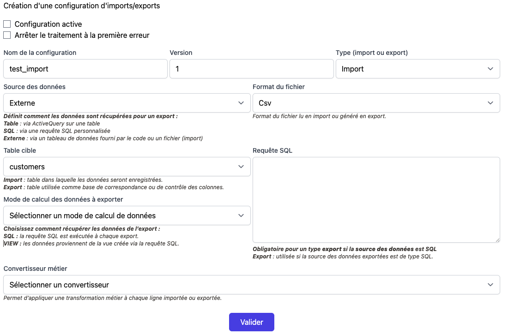
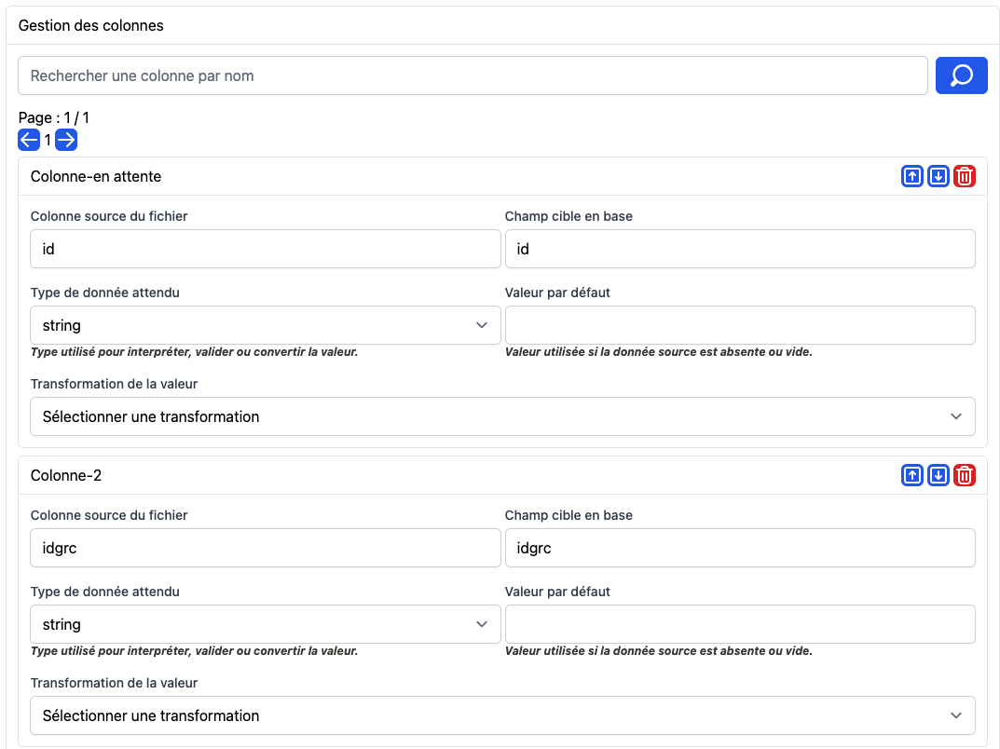
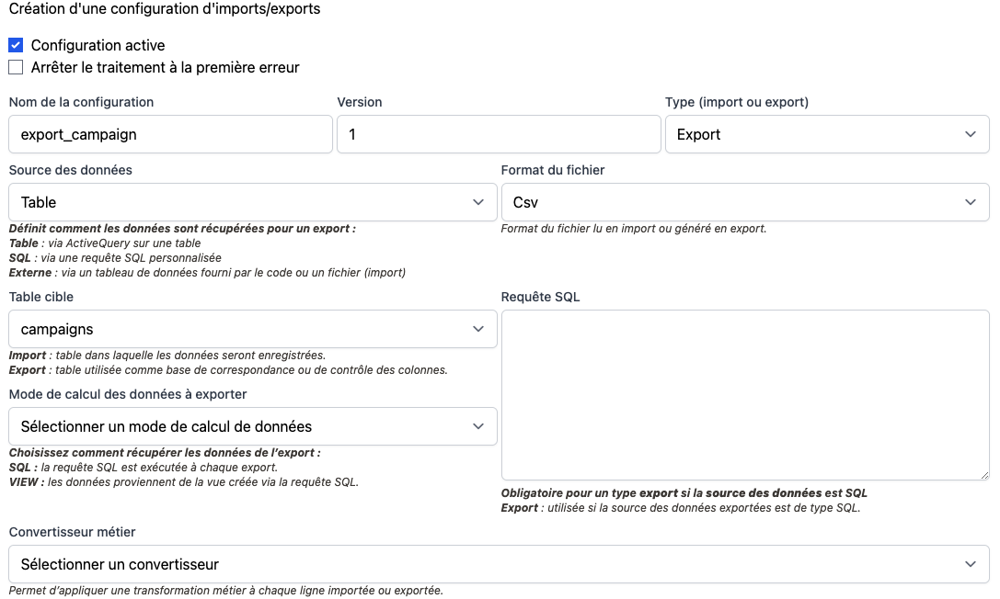
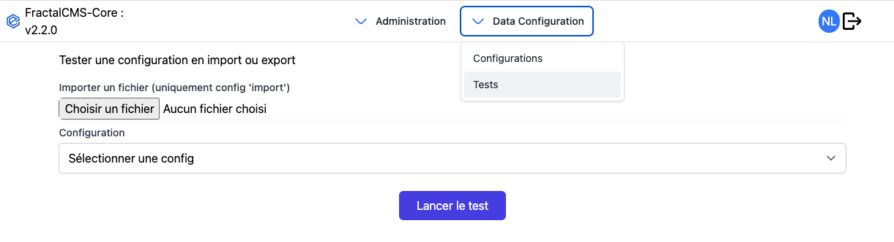

# Configuration

## Gestion de la configuration des imports ou exports

### Interface



### Créer

Afin de créer une nouvelle configuration 2 chemins sont prévus.

#### Import d'un fichier JSON

En important un fichier au format JSON avec le format suivant :

```json
{
"metas":{"name":"nom de la configuration","version":1,"type":"la source ('table', 'sql', 'extern')", "sourceType":"type de la source", "fileFormat":"xml", "active":1, "stopOnError":"1 ou 0, permet de stopper dès la première erreur", "table":"nom de la table", "rowProcessor":"nom de votre row processor"},
"records":[
	{"fields":
		[
		  {
      "source": "column-1",
      "target": "Colonne 1",
      "format": "string"
    },
    {
      "source": "column-2",
      "target": "Colonne 2",
      "format": "string"
    },
     {
      "source": "dateStart",
      "target": "Date_entree",
      "format": "string",
      "transformer":{
          "name":"date"
      },
      "transformerOptions":{
        "from":"d/m/Y",
        "to":"Y-m-d"
      }
    },
     {
      "source": "dateEnd",
      "target": "Date_sortie",
      "format": "string",
       "transformer":{
          "name":"agent"
      },
      "transformerOptions":{
        "from":"d/m/Y",
        "to":"Y-m-d"
      }
    }
	]
}
]}
```
Le fichier sera vérifié, validé, le formulaire et les colonnes seront automatiquement créées et l'application redirigera vers le formulaire valorisé.

### Création manuelle 

En cliquant sur le bouton "Créer manuellement", un formulaire de création sera proposer.



**Attention**: la clé [nom, version] doit-être unique dans l'application

* **Configuration active** : La configuration est active
* **Arrêter le traitement à la première erreur** : arrête le traitement en cas d'erreur (import)
* **Nom de la configuration** : Obligatoire : nom de la configuration
* **version** : Obligatoire : version de cette configuration
* **Type (import ou export)** : Configuration pour un **import** ou un **export**
* **TSource des données** : Source des données
    * **externe** : En import indique que la source est externe (fichier), en export indique d'ou vient la source (extern:données externe via un Row processor, Table : export de la table, SQL : export du résultat de la requête SQL)
    * **table** : Table de la base de données
    * **SQL** : Requête SQL
* **Format du fichier** : Format du fichier d'import ou du fichier exporté
* **Table cible** : table de la base de données ciblé (type de source = 'table' ou 'extern' pour un import)
* **Requête SQL** : Requête SQL ciblé (type de source = 'sql')
* **Mode de calcul des données à exporter** : Dans le cas d'un requête SQL, ce paramètre permet de déterminer si l'export relancera la requête SQL ou lira la view généré
* **Convertisseur métier** : Convertisseur métier **RowProcessors** cette option indique que chaque ligne sera traiter via une autre implémentation (voir [initialisation](initialisation.md))


### Création d'une configuration IMPORT



* **source des données** est toujours **'Externe'**
* **Table cible** Obligatoire

#### Une fois le formulaire rempli et validé 

Les colonnes sont automatiquements créées.



Chaque colonne peuvent-être paramétrées individuellement, les transformeurs peuvent-être utilisés afin de convertir la donnée vers le format voulu pour l'import ou l'export


### Création d'une configuration EXPORT



#### Source de données

* **Externe** : les données viennent d'un source externe et devront être traitées avec un **convertisseur métier** 
* **Table** : Les données viennent de la table indiquées dans le champs **table cible**
* **Sql** : Les données viennent de la requête valorisée dans le champs **requête SQL**

Les colonnes seront automatiquement créées pour les sources **table** et **sql**.

## L'interface de test



Cette interface permet de tester les configurations d'import et d'export.

Les imports testé sont encadrés par une transaction SQL afin qu'aucune données ne soient enregistré.

L'interface affichera les erreurs.

Les exports seront réalisé avec une limite de mémoire calculée. les gros exports Xslx ou XML ne seront pas exécutés.

[<- Précédent](concept.md) | [Suivant ->](processors.md)