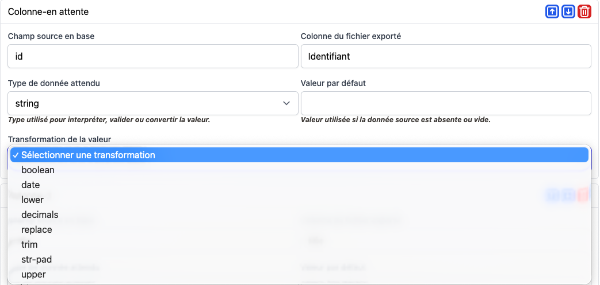

# Processors & Transformers

Les proccesseurs sont le cœur de la personnalisation du module.

Ils permettent d’adapter le comportement sans toucher aux pipelines globales.

Ce sont des convertisseurs Métier l
---

## ColumnTransformer (Transformer)
 
### Rôle

- Transformer la valeur de la colonne avant import ou export



Les transformers de colonne sont appliqués avant le convertisseur métier (rowProcessor) si il existe.

Des paramètres sont parfois demandés pour certains transformers

## RowImportProcessors (processor)

Les RowImportProcessors doivent respecter une Interface RowImportProcessor 

```php
use fractalCms\importExport\exceptions\RowProcessorResult;
use ractalCms\importExport\pipeline\interfaces\RowImportProcessor;
use fractalCms\importExport\runtime\contexts\Import as ImportContext;

final class ImportRowProcessor implements RowImportProcessor
{


    /**
     * @return string
     */
    public function getName(): string
    {
        return 'nom-1';
    }

    /**
     * @param array $row
     * @param ImportContext $context
     * @param array $params
     * @return RowProcessorResult
     */
    public function process(array $row, ImportContext $context, $params = []): RowProcessorResult
    {
        try {
            /**
            * Ici le code de traitement de la ligne avant l'import
            * 
            **/
            return new RowProcessorResult($row, true);
        } catch (Exception $e)  {
            Yii::error($e->getMessage(), __METHOD__);
            throw  $e;
        }
    }
}
```

Afin de pouvoir l'utiliser, le RowImportTransformer doit être ajouté dans la configuration de l'application


```php
'fractal-cms-export' => [
        'class' =>  \fractalCms\importExport\Module::class,
        'pathsNamespacesModels' => [
            '@app/models' => 'app\\models\\', /*path des models active record de votre application*/
        ],
        /*Ajout de processeurs de ligne (RowTransformer)*/
        'rowProcessorss' => [
        /* Pour les configurations import*/
            'import' => [
                'nom-1' => [
                    'class' => ImportRowProcessor::class,
                    'label' => 'Nom 1 (Import)',
                ],
            ]
    ],
```


il suffit de le sélectionner dans le formulaire pour que toutes les lignes soient traitées avec.

### Rôle

- modifier, adapter une ligne issue d’un **reader**
- Appliquer la logique métier minimale nécessaire à l’import (insertion dans plusieurs tables)

### Exemples d’usage

- Renommer des champs
- Convertir des types
- Valider des valeurs
- Ignorer certaines lignes
- Modifier ou créer des enregistrements dans d'autres tables

### Bonne pratique

Un `RowImportProcessor` permet de :

- Intéragir sur plusieurs tables
- Manipuler et adapter les données reçues

---

## RowExportProcessor (processor)

Les RowExportProcessor doivent respecter une Interface RowExportTransformer

```php
use fractalCms\importExport\exceptions\RowProcessorResult;
use fractalCms\importExport\runtime\contexts\Export as ExportContext;
use ractalCms\importExport\pipeline\interfaces\RowExportProcessor;

final class ExportRowProcessor implements RowExportProcessor
{


    /**
     * @return string
     */
    public function getName(): string
    {
        return 'nom-2';
    }

    /**
     * @param array $row
     * @param ExportContext $context
     * @param array $params
     * 
     * @return RowProcessorResult
     */
    public function process(array $row, ExportContext $context, $params = []): RowProcessorResult
    {
        try {

            /**
            * Icic le code de traitement de la ligne avant de l'écrire dans le fichier
            *
            **/
            $context->rowOffset = 1;
            //Défini l'intitulé de l'onglet (export en Xlsx )
            $context->sectionName = 'structure';
            //Ecrit les colonnes d'entête
            $context->writePreambleOne(ArrayHelper::merge(
                [
                    'Production',
                    'normalisée de la période (A)',
                    'Production normalisée N-1 (B)',
                    'Objectif Attendu (C)',
                    '% var N/N-1 (A/B-1)',
                    '% Atteint (A/C)'
                ],
                1,
                1
            );
            //Ecrit les données
            $context->writeRow(row: row);
            return new RowProcessorResult($row, true);
        } catch (Exception $e)  {
            Yii::error($e->getMessage(), __METHOD__);
            throw  $e;
        }
    }
}
```

Paramétrage dans le configuration de l'application hôte

```php
'fractal-cms-export' => [
        'class' =>  \fractalCms\importExport\Module::class,
        'pathsNamespacesModels' => [
            '@app/models' => 'app\\models\\', /*path des models active record de votre application*/
        ],
        /*Ajout de transformer de ligne (RowProcessor)*/
        'rowProcessors' => [
        /* Pour les configurations import*/
            'import' => [
                'nom-1' => [
                    'class' => ImportRowProcessor::class,
                    'label' => 'Nom 1 (Import)',
                ],
            ],
        /* Pour les configurations export*/
            'export' => [
                'nom-1' => [
                    'class' => ExportRowProcessor::class,
                    'label' => 'Nom 1 (export)',
                ],
            ],

        ],
    ],
```
il suffit ensuite de le sélectionner dans le formulaire pour que toutes les lignes soient traitées par le transformer.


### Rôle

- Adapter une ligne issue d'un fichier
- Préparer les données pour la sortie

### Exemples d’usage

- Formatage de dates
- Ajout de colonnes calculées
- Normalisation de données
- Conversion de structures
- Ajout d'onglet (Export en Xlsx)

### Bonne pratique

Un `RowExportProcessor` permet de :

- Créer un fichier Excel complexe
- Modifier et adapter les données pour la sortie
- Effectuer une logique métier complexe

[<- Précédent](configuration.md) | [Suivant ->](import.md)