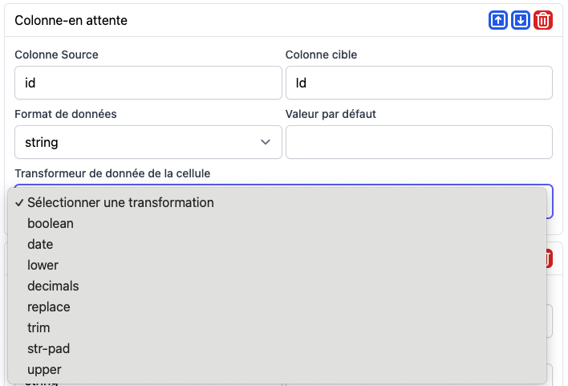
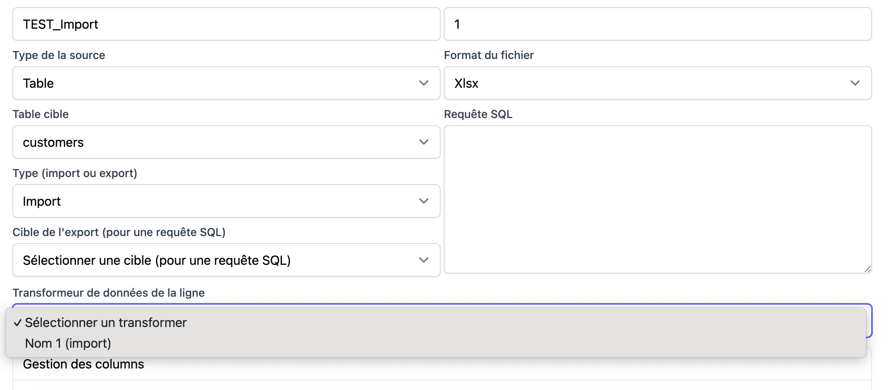
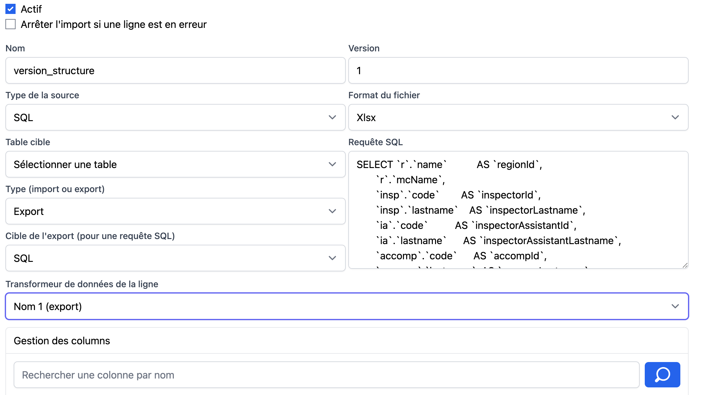

# Transformers

Les Transformers sont le cœur de la personnalisation du module.

Ils permettent d’adapter le comportement sans toucher
au pipeline global.

---

## ColumnTransformer

### Rôle

- Transformer la valeur de la colonne avant import ou export



Les transformers de colonne sont appliqués avant le RowTransformer.

## RowImportTransformer

Les RowTransformer doivent respecter une Interface RowImportTransformer 

```php
use fractalCms\importExport\interfaces\RowImportTransformer as RowImportTransformerInterface;

final class ImportRowTransformer implements RowImportTransformerInterface
{


    /**
     * @return string
     */
    public function getName(): string
    {
        return 'nom-1';
    }

    /**
     * @param array $row
     * @param ImportContext $context
     * @return RowTransformerResult
     */
    public function transformRow(array $row, ImportContext $context): RowTransformerResult
    {
        try {
            /**
            * Ici le code de traitement de la ligne avant l'import
            * 
            **/
            return new RowTransformerResult($row, true);
        } catch (Exception $e)  {
            Yii::error($e->getMessage(), __METHOD__);
            throw  $e;
        }
    }
}
```

Afin de pouvoir l'utiliser, le RowImportTransformer doit être ajouté dans la configuration de l'application


```php
'fractal-cms-export' => [
        'class' =>  \fractalCms\importExport\Module::class,
        'pathsNamespacesModels' => [
            '@app/models' => 'app\\models\\', /*path des models active record de votre application*/
        ],
        /*Ajout de transformer de ligne (RowTransformer)*/
        'rowTransformers' => [
        /* Pour les configurations import*/
            'import' => [
                'nom-1' => [
                    'class' => ImportRowTransformer::class,
                    'label' => 'Nom 1 (Import)',
                ],
            ]
    ],
```



il suffit de le sélectionner dans le formulaire pour que toutes les lignes soient traitées par le transformer.
### Rôle

- Transformer une ligne issue d’un Provider
- Appliquer la logique métier minimale nécessaire à l’import

### Exemples d’usage

- Renommer des champs
- Convertir des types
- Valider des valeurs
- Ignorer certaines lignes

### Bonne pratique

Un `RowImportTransformer` doit :
- rester simple
- ne pas accéder à des dépendances lourdes
- ne pas gérer de persistance directe

---

## RowExportTransformer

Les RowExportTransformer doivent réspecter une Interface RowExportTransformer

```php
use fractalCms\importExport\interfaces\RowExportTransformer as RowExportTransformerInterface;

final class ExportRowTransformer implements RowExportTransformerInterface
{


    /**
     * @return string
     */
    public function getName(): string
    {
        return 'nom-2';
    }

    /**
     * @param array $row
     * @param ExportContext $context
     * @return RowTransformerResult
     */
    public function transformRow(array $row, ExportContext $context): RowTransformerResult
    {
        try {

            /**
            * Icic le code de traitement de la ligne avant de l'écrire dans le fichier
            *
            **/
            $context->writeRow(sheet: 'structure',row: $row,startRow: $context->rowNumber);
            return new RowTransformerResult($row, true);
        } catch (Exception $e)  {
            Yii::error($e->getMessage(), __METHOD__);
            throw  $e;
        }
    }
}
```

Paramétrage dans le configuration de l'application hôte

```php
'fractal-cms-export' => [
        'class' =>  \fractalCms\importExport\Module::class,
        'pathsNamespacesModels' => [
            '@app/models' => 'app\\models\\', /*path des models active record de votre application*/
        ],
        /*Ajout de transformer de ligne (RowTransformer)*/
        'rowTransformers' => [
        /* Pour les configurations import*/
            'import' => [
                'nom-1' => [
                    'class' => ImportRowTransformer::class,
                    'label' => 'Nom 1 (Import)',
                ],
            ],
        /* Pour les configurations export*/
            'export' => [
                'nom-1' => [
                    'class' => ExportRowTransformer::class,
                    'label' => 'Nom 1 (export)',
                ],
            ],

        ],
    ],
```
il suffit ensuite de le sélectionner dans le formulaire pour que toutes les lignes soient traitées par le transformer.



### Rôle

- Adapter une ligne issue de l’application
- Préparer les données pour la sortie

### Exemples d’usage

- Formatage de dates
- Ajout de colonnes calculées
- Normalisation de données
- Conversion de structures

### Bonne pratique

Un `RowExportTransformer` ne doit pas :
- modifier l’état de l’application
- effectuer de logique métier complexe

[<- Précédent](configuration.md) | [Suivant ->](import.md)